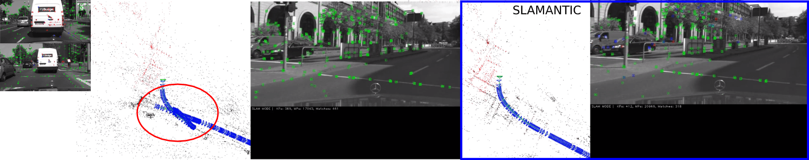

# SLAMANTIC - Leveraging Semantics to Improve VSLAM in Dynamic Environments 

This is the reference implementation of the method as described in the paper published at the ICCV Workshop [Deep Learning for Visual SLAM](http://visualslam.ai/). It is build on top of ORB_SLAM2. No additional dependency is necessary.

## License

As ORB-SLAM2, SLAMANTIC is also released under a GPLv3 license. For a list of all code/library dependencies (and associated licenses), please see Dependencies.md.

## Install

Option1: Please see original description at https://github.com/raulmur/ORB_SLAM2
Option2: Use provided docker

`./build_docker.sh` builds docker image with tag `slamantic`

## Semantic Labeling

The implementation works with RGB and Label-ID images as input. 
The input type and semantic of each label is defined in `slamantic/labels/labels-.yaml`. See comments in yaml for details. Prefer the use of Label-ID images due to less memory and faster lookup.
Probability images are required as CV_8U images (0=low, 255=high probability) otherwise, a probability of 1 is used.
Please store the labeled images for each dataset as suggested below for each dataset.

## Examples


Checkout: https://youtu.be/tfdv7bsz5fI



### VKITTI

Download [VKITTI2](https://europe.naverlabs.com/research/computer-vision/proxy-virtual-worlds-vkitti-2/).

Create KITTI trajectory files for sequences with `vkitti_create_extrinsic.py --dataset $vkitti_dataset_dir`. The generated trajectories for each camera are named `extrinsic_cameraN.txt` and are used to load the dataset and evaluate against it.

`stereo_vkitti vocab.txt Examples/Stereo/VKITTI-[b,df,m].yaml slamantic/labels/labels-vkitti2.yaml $vkitti_dataset_dir/$scene/$variation`

### Cityscapes

For evaluation we use the full Frankfurt stereo sequence. Download and create a `frames.txt` for your sequence containing all frame names (without channel specification).
We run our SLAM experiment on half the resolution. The following structure is used for a sequence:

```$xslt
frames.txt < sequence of frames (e.g. frankfurt_000001_000017)
imageResized < left resized images (half resolution)
imageRightResized < left resized images (half resolution)
timestamp
vehicle
dla/labelIds < semantic image from imageResized
dla/labelProababilities < probabilities of semantic image 
```

use `scripts/cityscapes_create_gt.py --dataset $cityscapes_dir/$sequence` to create:
 * `gt.txt`: GPS trajectory in local coordiante system, optionally with elevation-gapi
 * `speed.txt`: timestamp and speed (m/s) pairs from vehicle data
 * `gps.html`: gps visualization of trajectory (add `--map` to generate)

`stereo_cityscapes vocab.txt $cityscapes_dataset/Examples/Stereo/cityscapes-[b,df,m].yaml slamantic/labels/labels-cityscapes.yaml $cityscapes_dir/$sequence [startn] [length]`

### TUM-RGBD

Please see [DynaSLAM](https://github.com/BertaBescos/DynaSLAM) how to prepare the dataset (create association files) and how to use MaskRCNN. `Modify the MaskRCNN.py::GetDynSeg()` to write class id instead off `255` into resulting mask image. 

Put the semantic labeled images in `$tum_dataset_dir/$sequence/$algorithm/rgb`. `$algorithm` is defined in the semantic description file (`semantic:algorithm`). For TUM `maskrcnn` is used. 

`rgbd_tum vocab.txt Examples/RGB-D/TUM3-[b,df,m].yaml slamantic/labels/labels-maskrcnn.yaml $tum_dataset_dir/$sequence $tum_dataset_dir/$sequence/associations.txt`

### KITTI

Put semantic image into `$kitti_dataset_dir/$sequence/$algorithm/[labelIds,labelProbabilities]`. `$algorithm` is specified in the semantic description file. 

`stereo_kitti vocab.txt Examples/Stereo/KITTI$sequence-[b,df,m].yaml slamantic/labels/labels-cityscapes.yaml $kitti_dataset_dir/$sequence`

# ORB-SLAM2

# 1. License

ORB-SLAM2 is released under a [GPLv3 license](https://github.com/raulmur/ORB_SLAM2/blob/master/License-gpl.txt). For a list of all code/library dependencies (and associated licenses), please see [Dependencies.md](https://github.com/raulmur/ORB_SLAM2/blob/master/Dependencies.md).

# 2. Prerequisites
We have tested the library in **Ubuntu 12.04**, **14.04** and **16.04**, but it should be easy to compile in other platforms. A powerful computer (e.g. i7) will ensure real-time performance and provide more stable and accurate results.

## C++11 or C++0x Compiler
We use the new thread and chrono functionalities of C++11.

## Pangolin
We use [Pangolin](https://github.com/stevenlovegrove/Pangolin) for visualization and user interface. Dowload and install instructions can be found at: https://github.com/stevenlovegrove/Pangolin.

## OpenCV
We use [OpenCV](http://opencv.org) to manipulate images and features. Dowload and install instructions can be found at: http://opencv.org. **Required at leat 2.4.3. Tested with OpenCV 2.4.11 and OpenCV 3.2**.

## Eigen3
Required by g2o (see below). Download and install instructions can be found at: http://eigen.tuxfamily.org. **Required at least 3.1.0**.

## DBoW2 and g2o (Included in Thirdparty folder)
We use modified versions of the [DBoW2](https://github.com/dorian3d/DBoW2) library to perform place recognition and [g2o](https://github.com/RainerKuemmerle/g2o) library to perform non-linear optimizations. Both modified libraries (which are BSD) are included in the *Thirdparty* folder.

## ROS (optional)
We provide some examples to process the live input of a monocular, stereo or RGB-D camera using [ROS](ros.org). Building these examples is optional. In case you want to use ROS, a version Hydro or newer is needed.

# 3. Building ORB-SLAM2 library and examples

Clone the repository:
```
git clone https://github.com/raulmur/ORB_SLAM2.git ORB_SLAM2
```

We provide a script `build.sh` to build the *Thirdparty* libraries and *ORB-SLAM2*. Please make sure you have installed all required dependencies (see section 2). Execute:
```
cd ORB_SLAM2
chmod +x build.sh
./build.sh
```

This will create **libORB_SLAM2.so**  at *lib* folder and the executables **mono_tum**, **mono_kitti**, **rgbd_tum**, **stereo_kitti**, **mono_euroc** and **stereo_euroc** in *Examples* folder.

# 4. Monocular Examples

## TUM Dataset

1. Download a sequence from http://vision.in.tum.de/data/datasets/rgbd-dataset/download and uncompress it.

2. Execute the following command. Change `TUMX.yaml` to TUM1.yaml,TUM2.yaml or TUM3.yaml for freiburg1, freiburg2 and freiburg3 sequences respectively. Change `PATH_TO_SEQUENCE_FOLDER`to the uncompressed sequence folder.
```
./Examples/Monocular/mono_tum Vocabulary/ORBvoc.txt Examples/Monocular/TUMX.yaml PATH_TO_SEQUENCE_FOLDER
```

## KITTI Dataset  

1. Download the dataset (grayscale images) from http://www.cvlibs.net/datasets/kitti/eval_odometry.php 

2. Execute the following command. Change `KITTIX.yaml`by KITTI00-02.yaml, KITTI03.yaml or KITTI04-12.yaml for sequence 0 to 2, 3, and 4 to 12 respectively. Change `PATH_TO_DATASET_FOLDER` to the uncompressed dataset folder. Change `SEQUENCE_NUMBER` to 00, 01, 02,.., 11. 
```
./Examples/Monocular/mono_kitti Vocabulary/ORBvoc.txt Examples/Monocular/KITTIX.yaml PATH_TO_DATASET_FOLDER/dataset/sequences/SEQUENCE_NUMBER
```

## EuRoC Dataset

1. Download a sequence (ASL format) from http://projects.asl.ethz.ch/datasets/doku.php?id=kmavvisualinertialdatasets

2. Execute the following first command for V1 and V2 sequences, or the second command for MH sequences. Change PATH_TO_SEQUENCE_FOLDER and SEQUENCE according to the sequence you want to run.
```
./Examples/Monocular/mono_euroc Vocabulary/ORBvoc.txt Examples/Monocular/EuRoC.yaml PATH_TO_SEQUENCE_FOLDER/mav0/cam0/data Examples/Monocular/EuRoC_TimeStamps/SEQUENCE.txt 
```

```
./Examples/Monocular/mono_euroc Vocabulary/ORBvoc.txt Examples/Monocular/EuRoC.yaml PATH_TO_SEQUENCE/cam0/data Examples/Monocular/EuRoC_TimeStamps/SEQUENCE.txt 
```

# 5. Stereo Examples

## KITTI Dataset

1. Download the dataset (grayscale images) from http://www.cvlibs.net/datasets/kitti/eval_odometry.php 

2. Execute the following command. Change `KITTIX.yaml`to KITTI00-02.yaml, KITTI03.yaml or KITTI04-12.yaml for sequence 0 to 2, 3, and 4 to 12 respectively. Change `PATH_TO_DATASET_FOLDER` to the uncompressed dataset folder. Change `SEQUENCE_NUMBER` to 00, 01, 02,.., 11. 
```
./Examples/Stereo/stereo_kitti Vocabulary/ORBvoc.txt Examples/Stereo/KITTIX.yaml PATH_TO_DATASET_FOLDER/dataset/sequences/SEQUENCE_NUMBER
```

## EuRoC Dataset

1. Download a sequence (ASL format) from http://projects.asl.ethz.ch/datasets/doku.php?id=kmavvisualinertialdatasets

2. Execute the following first command for V1 and V2 sequences, or the second command for MH sequences. Change PATH_TO_SEQUENCE_FOLDER and SEQUENCE according to the sequence you want to run.
```
./Examples/Stereo/stereo_euroc Vocabulary/ORBvoc.txt Examples/Stereo/EuRoC.yaml PATH_TO_SEQUENCE/mav0/cam0/data PATH_TO_SEQUENCE/mav0/cam1/data Examples/Stereo/EuRoC_TimeStamps/SEQUENCE.txt
```
```
./Examples/Stereo/stereo_euroc Vocabulary/ORBvoc.txt Examples/Stereo/EuRoC.yaml PATH_TO_SEQUENCE/cam0/data PATH_TO_SEQUENCE/cam1/data Examples/Stereo/EuRoC_TimeStamps/SEQUENCE.txt
```

# 6. RGB-D Example

## TUM Dataset

1. Download a sequence from http://vision.in.tum.de/data/datasets/rgbd-dataset/download and uncompress it.

2. Associate RGB images and depth images using the python script [associate.py](http://vision.in.tum.de/data/datasets/rgbd-dataset/tools). We already provide associations for some of the sequences in *Examples/RGB-D/associations/*. You can generate your own associations file executing:

  ```
  python associate.py PATH_TO_SEQUENCE/rgb.txt PATH_TO_SEQUENCE/depth.txt > associations.txt
  ```

3. Execute the following command. Change `TUMX.yaml` to TUM1.yaml,TUM2.yaml or TUM3.yaml for freiburg1, freiburg2 and freiburg3 sequences respectively. Change `PATH_TO_SEQUENCE_FOLDER`to the uncompressed sequence folder. Change `ASSOCIATIONS_FILE` to the path to the corresponding associations file.

  ```
  ./Examples/RGB-D/rgbd_tum Vocabulary/ORBvoc.txt Examples/RGB-D/TUMX.yaml PATH_TO_SEQUENCE_FOLDER ASSOCIATIONS_FILE
  ```

# 7. ROS Examples

### Building the nodes for mono, monoAR, stereo and RGB-D
1. Add the path including *Examples/ROS/ORB_SLAM2* to the ROS_PACKAGE_PATH environment variable. Open .bashrc file and add at the end the following line. Replace PATH by the folder where you cloned ORB_SLAM2:

  ```
  export ROS_PACKAGE_PATH=${ROS_PACKAGE_PATH}:PATH/ORB_SLAM2/Examples/ROS
  ```
  
2. Execute `build_ros.sh` script:

  ```
  chmod +x build_ros.sh
  ./build_ros.sh
  ```
  
### Running Monocular Node
For a monocular input from topic `/camera/image_raw` run node ORB_SLAM2/Mono. You will need to provide the vocabulary file and a settings file. See the monocular examples above.

  ```
  rosrun ORB_SLAM2 Mono PATH_TO_VOCABULARY PATH_TO_SETTINGS_FILE
  ```
  
### Running Monocular Augmented Reality Demo
This is a demo of augmented reality where you can use an interface to insert virtual cubes in planar regions of the scene.
The node reads images from topic `/camera/image_raw`.

  ```
  rosrun ORB_SLAM2 MonoAR PATH_TO_VOCABULARY PATH_TO_SETTINGS_FILE
  ```
  
### Running Stereo Node
For a stereo input from topic `/camera/left/image_raw` and `/camera/right/image_raw` run node ORB_SLAM2/Stereo. You will need to provide the vocabulary file and a settings file. If you **provide rectification matrices** (see Examples/Stereo/EuRoC.yaml example), the node will recitify the images online, **otherwise images must be pre-rectified**.

  ```
  rosrun ORB_SLAM2 Stereo PATH_TO_VOCABULARY PATH_TO_SETTINGS_FILE ONLINE_RECTIFICATION
  ```
  
**Example**: Download a rosbag (e.g. V1_01_easy.bag) from the EuRoC dataset (http://projects.asl.ethz.ch/datasets/doku.php?id=kmavvisualinertialdatasets). Open 3 tabs on the terminal and run the following command at each tab:
  ```
  roscore
  ```
  
  ```
  rosrun ORB_SLAM2 Stereo Vocabulary/ORBvoc.txt Examples/Stereo/EuRoC.yaml true
  ```
  
  ```
  rosbag play --pause V1_01_easy.bag /cam0/image_raw:=/camera/left/image_raw /cam1/image_raw:=/camera/right/image_raw
  ```
  
Once ORB-SLAM2 has loaded the vocabulary, press space in the rosbag tab. Enjoy!. Note: a powerful computer is required to run the most exigent sequences of this dataset.

### Running RGB_D Node
For an RGB-D input from topics `/camera/rgb/image_raw` and `/camera/depth_registered/image_raw`, run node ORB_SLAM2/RGBD. You will need to provide the vocabulary file and a settings file. See the RGB-D example above.

  ```
  rosrun ORB_SLAM2 RGBD PATH_TO_VOCABULARY PATH_TO_SETTINGS_FILE
  ```
  
# 8. Processing your own sequences
You will need to create a settings file with the calibration of your camera. See the settings file provided for the TUM and KITTI datasets for monocular, stereo and RGB-D cameras. We use the calibration model of OpenCV. See the examples to learn how to create a program that makes use of the ORB-SLAM2 library and how to pass images to the SLAM system. Stereo input must be synchronized and rectified. RGB-D input must be synchronized and depth registered.

# 9. SLAM and Localization Modes
You can change between the *SLAM* and *Localization mode* using the GUI of the map viewer.

### SLAM Mode
This is the default mode. The system runs in parallal three threads: Tracking, Local Mapping and Loop Closing. The system localizes the camera, builds new map and tries to close loops.

### Localization Mode
This mode can be used when you have a good map of your working area. In this mode the Local Mapping and Loop Closing are deactivated. The system localizes the camera in the map (which is no longer updated), using relocalization if needed. 

